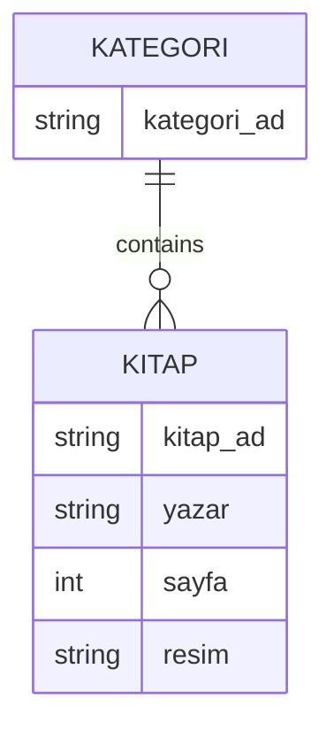

<div align="center">

# 📚 Kitaplık Uygulaması

A native iOS library application built with **SwiftUI** and **Core Data**.

The app organizes books by category, persists category–book relationships locally, and provides category, grid, and detail navigation flows.


</div>

---

## 🎯 Overview

This project demonstrates local relational data management in an iOS application.

The main navigation flow is:

```text
Categories
   ↓
Books in selected category
   ↓
Book details
```

Sample categories and books are seeded only when the local store is empty.

---

## ✨ Features

- Category list
- Category-to-book relationship
- Books filtered by selected category
- Two-column book grid
- Book detail navigation
- Local persistence with Core Data
- Initial sample-data seeding
- SwiftUI `NavigationStack`
- Observable view models

---

## 🧠 Core Data Model

The project contains a Core Data model named:

```text
KitaplarModel.xcdatamodeld
```

The application uses related category and book entities.

Conceptually:



The exact generated managed-object properties should be treated as the source of truth for the local schema.

---

## 🏗️ Project Structure

```text
KitaplikUygulamasi/
├── data/
│   └── entity/
├── ui/
│   ├── list/
│   │   ├── KategoriItem.swift
│   │   └── KitaplarSatir.swift
│   ├── view/
│   │   ├── Anasayfa.swift
│   │   ├── Kitapsayfa.swift
│   │   └── Detaysayfa.swift
│   └── viewmodel/
│       ├── AnasayfaViewModel.swift
│       └── KitapSayfaViewModel.swift
├── PersistenceController.swift
├── KitaplarModel.xcdatamodeld
└── ...
```

---

## 🔄 Application Flow


---

## 🌱 Initial Data

When the category store is empty, the application creates sample content.

The current source seeds categories such as:

- Roman
- Hikaye
- Şiir

and associates sample books with their categories through Core Data relationships.

This allows the app to demonstrate relational persistence without requiring a remote API.

---

## 🛠️ Tech Stack

- Swift
- SwiftUI
- Core Data
- Combine-style `ObservableObject` state
- MVVM-style separation

---

## 🚀 Getting Started

### Prerequisites

- macOS
- Xcode
- iOS Simulator or physical iOS device

### Installation

```bash
git clone https://github.com/halilkrm/KitaplikUygulamasi.git
cd KitaplikUygulamasi
```

Open the Xcode project, select a simulator/device, and run the app.

No external backend is required for the current Core Data flow.

---

## ⚠️ Notes

- The application uses local persistence.
- Sample content is inserted only when the relevant store is empty.
- The current project is an educational iOS application and can be extended with create/edit/delete forms and richer validation.

---
